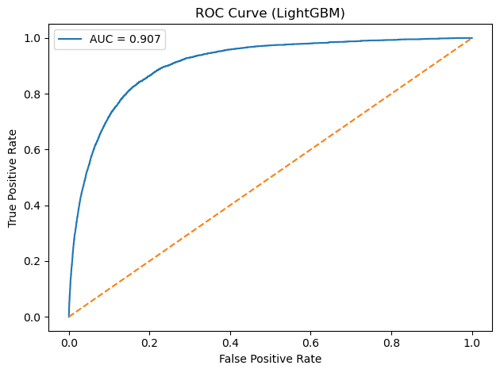
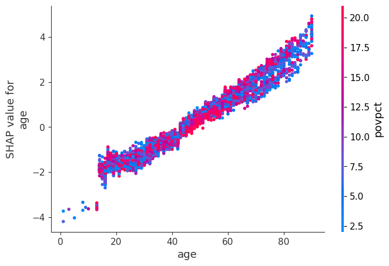

```{r setup, include=FALSE}
knitr::opts_chunk$set(echo = FALSE, message = FALSE, warning = FALSE)
library(knitr)
library(dplyr)
```

1. Introduction

This project predicts 5-year all-cause mortality among U.S. smokers using a Light Gradient Boosting Machine (LightGBM) classifier applied to the NLMS Tobacco Use Cohort. The dataset contains nearly 500,000 individuals with rich demographic, socioeconomic, and behavioral predictors. Because mortality is a rare event (≈4%), the modeling approach must address severe class imbalance while preserving sensitivity to at-risk individuals. LightGBM was selected for its strong performance on large, imbalanced tabular data and its compatibility with model interpretability tools such as SHAP.

2. Data & Preprocessing

The outcome variable is a binary indicator of death within 5 years (inddea). Predictors include:

 - Demographics: age (age), sex (sex), race/ethnicity (race), country of birth (pob), region of residence (stater)
 - Socioeconomic: income-to-poverty ratio (povpct), education (educ), employment status (esr), occupation (majocc), citizenship (citizen)
 - Household/Social: marital status (ms), number of people living in household (hhnum), veteran status (vt)
 - Health-related: health insurance coverage status (histatus), smoking status (smokstat), smoked more than 100 cigarettes in lifetime (smok100), smokeless tobacco use (everuse)

2.1 Imbalanced outcome

Deaths account for only ~4% of observations: Survived (0)	378501; Died (1)	16124. Therefore, a naive classifier would achieve ~96% accuracy by predicting survival for everyone. This required explicit correction. This makes accuracy misleading and highlights the importance of metrics such as recall, balanced accuracy, ROC-AUC, and PR-AUC.

2.2 Categorical encoding

Categorical predictors (e.g., marital status, employment, region, smoking status) were converted into machine-readable form using one-hot encoding. Binary variables remained as 0/1, and continuous variables (e.g., age, povpct) were not altered.

2.3 Handling class imbalance

LightGBM’s scale_pos_weight parameter was set to: scale_pos_weight = (# survivors / # deaths). This increases the penalty for misclassifying deaths and helps the model focus on the minority class without oversampling or synthetic data generation. A stratified 80/20 split ensured proportional representation of deaths in both sets.

3. Methods

A LightGBM classifier [1] was trained on the one-hot encoded feature matrix. Model development included:

 - Objective: binary logistic loss
 - Evaluation metrics: accuracy, balanced accuracy, precision, recall, F1, ROC-AUC, PR-AUC
 - Cross-validation: 5-fold CV to estimate generalization performance
 - Hyperparameters: tuned learning rate, max depth, number of leaves, number of trees
 - Imbalance correction: scale_pos_weight as described above.

3.1 Rationale for LightGBM

LightGBM is well suited for this task due to:

 - Efficiency on very large tabular datasets
 - Ability to model nonlinear and interaction effects
 - Native handling of class imbalance
 - Interpretability via SHAP
 
4. Results & Discussions

4.1 Cross-validated performance

```{r}
cv_results <- tribble(
~Metric, ~Mean, ~SD,
"Accuracy", 0.8309, 0.0012,
"Balanced Accuracy", 0.8361, 0.0012,
"Precision", 0.1745, 0.0012,
"Recall", 0.8418, 0.0015,
"F1-score", 0.2891, 0.0017,
"ROC-AUC", 0.9087, 0.0022,
"PR-AUC", 0.3497, 0.0099
)
kable(cv_results, digits=4,
caption="Five-fold cross-validation results for LightGBM.")
```
4.2 Test-set performance

```{r}
test_results <- tribble(
~Metric, ~Value,
"Accuracy", 0.8265,
"Balanced Accuracy", 0.8341,
"Precision", 0.1708,
"Recall", 0.8425,
"F1-score", 0.2841,
"ROC-AUC", 0.9070,
"PR-AUC", 0.3563
)
kable(test_results, digits=4,
caption="Held-out test-set performance for LightGBM.")

```

The model achieved a recall of 0.8425 on the held-out test set, meaning that it correctly identified approximately 84% of all individuals who actually died. In public health and clinical risk prediction settings, this is a critical property: "False negatives (missed deaths) are more harmful than false positives."

High recall indicates that the model is effective at capturing true high-risk cases, even when they form a very small portion of the population. This sensitivity is especially valuable for early intervention, population screening, and prioritizing individuals for health outreach or monitoring.

Precision was relatively low (0.1708), which is expected in datasets where the positive class is extremely rare. Low precision does not indicate model failure in this context; instead, it reflects the inherent difficulty of predicting a rare outcome.

4.3 ROC Curve

```{r ROC_curve, out.width="50%", fig.cap="ROC Curve for LightGBM"}

```

The model’s ROC-AUC of 0.907 indicates excellent ability to distinguish between individuals who died and those who survived across all possible classification thresholds. Additionally, the PR-AUC of 0.356 is strong given the 4% event rate; random guessing would achieve a PR-AUC near 0.04. This demonstrates that the model is identifying high-risk individuals far better than chance, despite class imbalance.

4.4 Key Feature Effects

To better understand how the model assigns risk, SHAP dependence analysis was used to examine the effect of the most influential predictors. Age showed a strong, monotonic relationship with mortality risk: SHAP values increased steadily with age, indicating that older individuals contribute substantially more to predicted mortality. This effect was consistent across all income levels. Other influential features included citizenship category, age, sex, smoking, and income-to-poverty ratio, reflecting the combined biological and socioeconomic determinants of mortality.

```{r shap-age, out.width="50%", fig.cap="SHAP dependence plot for age"}

```

5. Conclusion

This project developed a LightGBM classifier to predict 5-year mortality among smokers in the NLMS Tobacco Use Cohort, a large and highly imbalanced dataset. After one-hot encoding categorical variables and applying class weighting to address the rarity of death events, the model demonstrated strong performance on both cross-validation and held-out test data. High recall and AUC values indicate that the model effectively identifies individuals at elevated mortality risk, even when the positive class represents only ~4% of the population. Although precision is low, as expected in rare-event prediction, the model’s ability to capture the majority of true deaths makes it suitable for screening and population risk stratification. Overall, LightGBM provides a robust, efficient, and interpretable framework for mortality prediction in large epidemiologic datasets, offering practical utility for public health research and targeted intervention strategies.

Reference:

[1] Ke, G., Meng, Q., Finley, T., Wang, T., Chen, W., Ma, W., ... & Liu, T. Y. (2017). Lightgbm: A highly efficient gradient boosting decision tree. Advances in neural information processing systems, 30.


