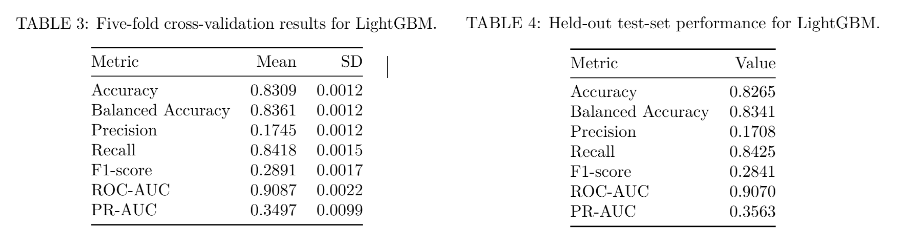

---
output:
  pdf_document: default
  word_document: default
  html_document: default
geometry: margin=0.5in
header-includes:
  - \usepackage{titlesec}
  - \titlespacing*{\section}{0pt}{0.2em}{0.1em}
  - \titlespacing*{\subsection}{0pt}{0.2em}{0.1em}
  - \titlespacing*{\subsubsection}{0pt}{0.2em}{0.1em}
---

```{r setup, include=FALSE}
knitr::opts_chunk$set(echo = TRUE)
library(knitr)
library(dplyr)
```

# Modeling of Smoking-Related Mortality: A Big-Data Analysis of the NLMS (National Longitudinal Mortality Study) Tobacco-Use Cohort in the U.S.

### Authors: Naman Dariwhal, Nicole Jerome, Indhira Vadivel

### Link to GitHub: <https://github.com/nicole-jerome/biostat625_project_ND_NJ_IV>

# Abstract

Smoking has negative impacts on individuals and society. It is associated with increased disease burden, reduced quality of life and lifespan, and resulting negative health outcomes place unnecessary economic burden on healthcare systems. As such, public health policy and interventions have the potential to impact smoking habits and outcomes. However, strong data that identifies risk factors for smoking-related mortality and prediction tools that identify individuals with the highest risk would aid in informing policy decisions and focus intervention efforts. Recent advances in mathematical modeling and machine learning present new opportunities to leverage big data in order to support data-driven public health decision-making. In this study, we leverage the National Longitudinal Mortality Study (NLMS) Public Use Microdata Sample (PUMS) Tobacco Use Cohort to build interpretable models of mortality risk by accounting for socioeconomic and lifestyle factors alongside tobacco use characteristics. Through logistic regression, we found that smoking status and smoking duration were robust predictors of mortality. Additionally, our LightGBM machine learning model robustly identified individuals with high mortality risk, while overcoming a strong class imbalance within the dataset.

# Introduction

Cigarette smoking and tobacco use remain as the leading preventable causes of death worldwide, contributing to cardiovascular disease, cancer, and respiratory illness. Understanding the relationship between smoking duration, tobacco use, demographics, lifestyle factors and mortality is critical for public health strategies and prevention efforts.

Previous work [1] studied the effects of lifestyle and tobacco use on a Barcelona cohort, predicting effects on mental health. This pilot study substantiated the use of integrating lifestyle, socioeconomic and tobacco use attributes for a sound prediction of mental health disorders. However, the study lacked the use of a large-enough dataset, covering many facets of life, for an accurate measurement. Furthermore, the study did not predict mortality risk as a core research question. Several studies in the field face similar limitations.

To address these limitations, this project uses the large National Longitudinal Mortality Study (NLMS) Public Use Microdata Sample (PUMS) Tobacco Use Cohort and mathematical and machine learning models to predict mortality risk by accounting for demographic information, socioeconomic factors, and tobacco-use behaviors.

# Methods

## Data Acquisition and Description

The National Longitudinal Mortality Study (NLMS) Public Use Microdata Sample (PUMS) Tobacco Use Cohort (dataset file name: tu) contains 493,282 participants who were tracked over a five year period. Forty-three different variables including demographic information, socioeconomic factors, and smoking behaviors were collected for each individual. Importantly, the death indicator column (inddea) reported whether an individual was alive or deceased at the end of the follow up period. Data was acquired from the NIH-Biologic Specimen and Data Repository Information Coordinating Center under request number 17175 and was uploaded to GitHub for our analyses.

## Exploratory Data Analysis (EDA) and Logistic Regression

### 1. Workflow and Data Processing

A big-data workflow centered on Apache Arrow enabled efficient, memory-safe processing of the large dataset. This allowed fast columnar input/output, lazy evaluation, and on-disk querying without importing the entire file into memory— an approach that saved memory and computing costs over base R techniques. The raw .csv file (tu) was converted to a .parquet file, and was loaded as an Arrow dataset. Arrow and dplyr were used to subset the necessary variables for recoding and performing grouped operations. Smokeless tobacco use variables (curruse, everuse) were recoded into binary indicators and marital status was collapsed into two categories (married, not married/separated). Labeled factor variables were also created for readability.

### 2. Exploratory Data Analysis

Descriptive statistics were computed, stratified by sex, with categorical variables being summarized by counts or percentages, and continuous variables being summarized by means and standard deviations. Table 1 was generated using kableExtra to present all variables with clear labels and hierarchical indentation.

### 3. Variable Selection

Covariates were selected a priori based on established epidemiological evidence demonstrating their associations with both smoking behavior and mortality. Age is a strong determinant of baseline mortality risk [2], and sex differences in survival are well-documented [3]. Race/ethnicity influences mortality through structural and socioeconomic inequities [4], and socioeconomic status, particularly income, is closely linked to life expectancy [5]. Health insurance status affects access to healthcare and subsequently mortality risk [6], and marital status has a protective association with lower mortality [7]. Lastly, smoking duration, measured by age at initiation, has also been shown to independently influence long-term mortality [8]. As such, covariates considered in our logistic regression included age, race, sex, health insurance status, income, and marital status.

### 4. Logistic Regression Modeling

The association between cigarette smoking behavior and mortality was modeled using logistic regression. Mortality (inddea) was modeled as a binary outcome. Two main exposures were examined: (1) smoking status (never, everyday, some-days, former) and (2) smoking status plus smoking duration, operationalized by using age at smoking initiation (agesmk). Selected covariates are described above.

**MODEL 1:** Smoking Status 
$$
\text{logit}\big[P(\text{Death}_i = 1)\big] 
= \beta_0 
+ \beta_1\,\text{Smokestat}_i
+ \beta_2\,\text{Age}_i
+ \beta_3\,\text{Race}_i
+ \beta_4\,\text{Sex}_i
+ \beta_5\,\text{Insurance}_i
+ \beta_6\,\text{Income}_i
+ \beta_7\,\text{MaritalStatus}_i 
$$ 
**MODEL 2:** Smoking Status + Smoking Duration 
$$
\text{logit}\big[P(\text{Death}_i = 1)\big] = \gamma_0 + \gamma_1\,\text{Smokestat}_i + \gamma_2\,\text{AgeStartedSmoking}_i + \gamma_3\,\text{Age}_i + \gamma_4\,\text{Race}_i
$$ 
$$         
         + \gamma_5\,\text{Sex}_i + \gamma_6\,\text{Insurance}_i + \gamma_7\,\text{Income}_i + \gamma_8\,\text{MaritalStatus}_i
$$

All models were fit using generalized linear models with a binomial distribution and logit link in R. A univariate model estimated the crude association between smoking status and mortality, followed by multivariable models adjusting for confounders. Model performance was compared and selected using AIC and residual deviance. Odds ratios and 95% confidence intervals were computed by exponentiating model coefficients. Missing data were handled using complete-case analysis to ensure comparability across models.

## Machine Learning Predictor

### 1. Data Preprocessing

Within tu, the outcome variable (death indicator, inddea) was already coded as a binary predictor of death, however, each predictor needed to be assessed for its usefulness in the model. In total, 17 out of 43 variables were able to be used within the machine learning model. Variables that were redundant (ex: occupation code and industry code), irrelevant (ex: record number, presence of social security number), strongly subjective (ex: health status), confounded with the death indicator (ex: cause of death), contained a high percentage of missing data, or that were present but did not contain data (ex: standard metropolitan statistical area (smsa) status)(the tu file is a subset of a larger study and thus some identification data was not included), were eliminated. As such, the predictors included:

**Demographics:** age (age), sex (sex), race/ethnicity (race), country of birth (pob), region of residence (stater)\
**Socioeconomic:** income as percent of poverty ratio (povpct), education (educ), employment status (esr), occupation (majocc), citizenship (citizen)\
**Household/Social:** marital status (ms), number of people living in household (hhnum), veteran status (vt)\
**Health-Related:** health insurance coverage status (histatus), smoking status (smokstat), smoked more than 100 cigarettes in lifetime (smok100), smokeless tobacco use (everuse)

Categorical predictors (ex: marital status, employment, region of residence, smoking status) were converted into machine-readable form using one-hot encoding. Binary variables remained as 0/1, and continuous variables (ex: age, povpct) were not altered.

### 2. Handling Class Imbalance

In tu, deaths account for only \~4% of observations (Alive: 378,501; Deceased: 16,124). Therefore, a naive classifier model would achieve \~96% accuracy by predicting survival for everyone. If unaltered, the accuracy of this model would be misleading. This phenomena highlights the importance of additional metrics such as recall, balanced accuracy, ROC-AUC, and PR-AUC. Further, to correct for the imbalance, LightGBM’s scale_pos_weight parameter was set to: scale_pos_weight = (\# survivors / \# deaths). This setting increases the penalty for misclassifying deaths and helps the model focus on the minority class without oversampling or synthetic data generation. A stratified 80/20 (training/testing) data split ensured proportional representation of deaths in both data sets.

### 3. Machine Learning Modeling Methods

The Light Gradient Boosting Machine (LightGBM) [9] framework was chosen as a machine learning model due to its: efficiency on very large tabular datasets, ability to model nonlinear and interaction effects, native handling of class imbalance, and interpretability via SHapley Additive exPlanations (SHAP). A LightGBM classifier was trained on the one-hot encoded feature matrix. Model development included:

**Objective:** binary logistic loss\
**Evaluation metrics:** accuracy, balanced accuracy, precision, recall, F1, ROC-AUC, PR-AUC\
**Cross-validation:** 5-fold CV to estimate generalization performance\
**Hyperparameters:** tuned learning rate, max depth, number of leaves, number of trees\
**Imbalance correction:** scale_pos_weight, as described above

# Results

## Exploratory Data Analysis (EDA)

The tu dataset included 493,282 participants, with 230,967 males and 262,315 females. The sex-stratified descriptive statistics showed broadly similar age distributions between groups, while race, income, and health insurance patterns exhibited modest variation. Marital status differed by sex, with a higher proportion of males being married while females were more frequently not married or separated. Tobacco-related behaviors demonstrated clear sex-specific patterns: males reported higher rates of currently and ever using smokeless tobacco products and were more likely to have smoked at least 100 cigarettes in their lifetime. Additionally, the mean age of smoking initiation was slightly lower among males. Mortality proportions also varied slightly by sex. Overall, Table 1 summarizes these demographic, socioeconomic, and tobacco-use differences, providing a foundational characterization of the NLMS tobacco use cohort prior to inferential analysis.

| {width="50%"} {width="50%"}

## Logistic Regression

In the covariate adjusted smoking status model (Model 1), cigarette smoking status showed a strong graded association with mortality. Compared with never smokers, everyday smokers had more than double the odds of death (OR = 2.19), some-days smokers had 78% higher odds (OR = 1.78), and former smokers had 37% higher odds (OR = 1.37), demonstrating a clear dose–response pattern (Table 2).

When age at smoking initiation was added to the model (Model 2), the associations shifted. After adjustment, some-days smokers showed approximately 14% lower odds of mortality (OR = 0.86) and former smokers showed approximately 39% lower odds (OR = 0.61) relative to everyday smokers, likely reflecting the differences in cumulative smoking duration. Age at smoking initiation was independently associated with mortality, with each additional year of later initiation reducing mortality risk by about 2% (Table 2).

Across both models, age, sex, income, race, and marital status remained strong independent predictors of mortality. Age showed the largest effect, with each additional year associated with roughly 9% higher mortality risk. Females had substantially lower mortality compared to males (by 36–43%), while higher income and being married were consistently protective. Race differences persisted, with several groups showing higher or lower mortality risks relative to the reference category.

Overall, smoking status was a robust predictor of mortality, and incorporating smoking duration through age at initiation refined these associations. These findings suggest that both current smoking behavior and lifetime smoking history contribute meaningfully to mortality risk.

**TABLE 2:** Model 1 (Left), Model 2 (Right)

```{r, echo=FALSE, out.width="90%"}
knitr::include_graphics("files/reg_results_table.png")
```

## Machine Learning Predictor

### Validation Results

Five-fold cross-validation of our LightGBM model performed well, with metrics being outlined in Table 3.

### Testing Results

When classifying the held-out test set, the model's accuracy of 0.8265 and balanced accuracy of 0.8341 indicates a strong predictive performance, though accuracy is not the best measure of a model trained on a highly skewed dataset, as mentioned above. However, the closeness of these values indicates that the class imbalance is being handled well, mitigating over fitting.

Our model achieved a recall of 0.8425, meaning that it correctly identified approximately 84% of all individuals who actually died. In public health and clinical risk prediction settings, this is a critical property since false negatives (missed deaths) are more harmful than false positives. High recall indicates that the model is effective at capturing true high-risk cases, even when they form a very small portion of the population. This sensitivity is especially valuable for early intervention, population screening, and prioritizing individuals for health outreach or monitoring.

The model's precision was relatively low (0.1708), which is expected in datasets where the positive class is extremely rare. In this case, low precision does not indicate model failure; instead, it reflects the inherent difficulty of predicting a rare outcome.

```{r, echo=FALSE, out.width="90%"}

```

The model’s ROC-AUC of 0.907 (Table 4 & Figure 1) indicates excellent ability to distinguish between individuals who died and those who survived across all possible classification thresholds. Additionally, the PR-AUC of 0.356 is strong given the 4% event rate; random guessing would achieve a PR-AUC near 0.04. This demonstrates that the model is identifying high-risk individuals far better than chance, despite the class imbalance.

```{r ROC_curve, echo=FALSE, out.width="80%"}
knitr::include_graphics("figures/Figures 1 and 2.png")
```

### Key Feature Effects

To better understand how the model assigns risk, SHAP dependence analysis was used to examine the effect of the most influential predictors. Age showed a strong, monotonic relationship with mortality risk: SHAP values increased steadily with age, indicating that older individuals contribute substantially more to predicted mortality (Figure 2). This effect was consistent across all income levels. Other influential features included citizenship, sex, smoking, and income-to-poverty ratio, reflecting the combined biological and socioeconomic determinants of mortality.

# Conclusion

By leveraging the NLMS Tobacco Use Cohort, we were able to accurately model and predict mortality risk due to smoking-related behaviors and duration, while accounting for demographic and socioeconomic factors. Our logistic regression analysis, through adjusted odds ratios, showed that both smoking status and smoking duration had significant impact on the risk of mortality, even after covariates were accounted for. This analysis provides an interpretable framework for identifying how smoking behaviors effect mortality risk and the degree to which the selected covariates also impact mortality.  

Further, our LightGBM classifier demonstrated strong performance (on cross-validation and test-set data) on predicting 5-year mortality when taking into account the 17 chosen predictors. High recall and AUC values indicate that the model effectively identifies individuals at elevated mortality risk, even when the positive (deceased) class represents only \~4% of the population. Although precision is low, as expected in rare-event prediction, the model’s ability to capture the majority of true deaths makes it suitable for screening and population risk stratification. Overall, LightGBM provides a robust, efficient, and interpretable framework for mortality prediction in large epidemiologic datasets.

Taken together, our methods and the resulting analyses offer practical utility for public health research and designing targeted intervention strategies, with the goals of reducing smoking-related mortality, lessening population-wide disease burden, and improving overall public health.  

# Contributions
**Naman Dariwhal:** One-hot encoding and running LightGBM model, model validation, and data visualization. 
**Nicole Jerome:** Data cleaning, feature engineering for LightGBM model, compiling report.
**Indhira Vadivel:** Data acquisition and cleaning, EDA, logistic regressions.
**All:** Conceptualization, analysis and interpretation. We are in agreement that all members reasonably contributed according to their strengths. 

# References

**[1]** Dhariwal, N., Sengupta, N., Madiajagan, M., Patro, K. K., Kumari, P. L., Abdel Samee, N., Tadeusiewicz, R., Pławiak, P., & Prakash, A. J. (2024). A pilot study on AI-driven approaches for classification of mental health disorders. Frontiers in Human Neuroscience, 18, Article 1376338. <https://doi.org/10.3389/fnhum.2024.1376338> **[2]** Arias, E., & Xu, J. Q. (2022). United States life tables, 2019 (National Vital Statistics Reports, Vol. 70, No. 19). National Center for Health Statistics. <https://doi.org/10.15620/cdc:113096> **[3]** Kruger, D. J., & Nesse, R. M. (2006). An evolutionary life-history framework for understanding sex differences in human mortality rates. Evolutionary Psychology, 4(1), 66–85. <https://doi.org/10.1177/147470490600400114> **[4]** Williams, D. R., & Mohammed, S. A. (2009). Discrimination and racial disparities in health: Evidence and needed research. Journal of Behavioral Medicine, 32(1), 20–47. <https://doi.org/10.1007/s10865-008-9185-0> **[5]** Chetty, R., Stepner, M., Abraham, S., Lin, S., Scuderi, B., Turner, N., Bergeron, A., & Cutler, D. (2016). The association between income and life expectancy in the United States, 2001–2014. JAMA, 315(16), 1750–1766. <https://doi.org/10.1001/jama.2016.4226> **[6]** Wilper, A. P., Woolhandler, S., Lasser, K. E., McCormick, D., Bor, D. H., & Himmelstein, D. U. (2009). Health insurance and mortality in US adults. American Journal of Public Health, 99(12), 2289–2295. <https://doi.org/10.2105/AJPH.2008.157685> **[7]** Rendall, M. S., Weden, M. M., Favreault, M. M., & Waldron, H. (2011). The protective effect of marriage for survival: A review and update. Demography, 48(2), 481–506. <https://doi.org/10.1007/s13524-011-0032-5> **[8]** U.S. Department of Health and Human Services. (2014). The health consequences of smoking—50 years of progress: A report of the Surgeon General. <https://www.ncbi.nlm.nih.gov/books/NBK179276/> **[9]** Ke, G., Meng, Q., Finley, T., Wang, T., Chen, W., Ma, W., ... & Liu, T. Y. (2017). Lightgbm: A highly efficient gradient boosting decision tree. Advances in neural information processing systems, 30. <https://papers.nips.cc/paper_files/paper/2017/file/6449f44a102fde848669bdd9eb6b76fa-Paper.pdf>
